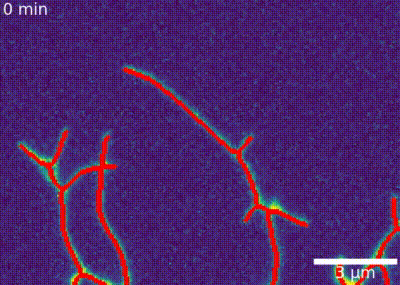

# biovideo
Little package for combining timelapse and mask as numpy array into mp4 videos. Also provides a scalebar and timestamp. Auto-detects FFmpeg and downloads a static build if missing.

## Install
```bash
pip install -e .
```

## Usage
### Movie with scalebar and timestamp
```python
from biovideo import make_movie
movie = io.imread("examples/data/movie.tif")
mask = io.imread("examples/data/skel_stack.tif")

make_movie(
    movie, 
    os.path.join(outdir, "movie.mp4"),
    mask=mask, 
    label_mask=False, 
    num_unit_scale=3,
    scale = 16,
    space_unit="µm",
    time_interval=1,
    time_unit="min",
    pos_time = (0.01,0.05),
    fps=5,
    img_cmap = "viridis",
    mask_cmap = mask_cmap,
    fontsize=15,
    scale_width=3,
    )
```


### Movie with plot
 ```python
time = np.arange(movie.shape[0])
metric = np.sin(time / 10) + np.random.normal(0, 0.05, size=movie.shape[0])

make_movie(
    movie, 
    os.path.join(outdir, os.path.join(outdir, "movie_with_plot.mp4")),
    time=time,
    metric=metric, 
    xlabel="t", 
    ylabel="metric",
    mask=mask,  
    num_unit_scale=3,
    scale = 16,
    space_unit="µm",
    time_interval=1,
    time_unit="min",
    pos_time = (0.01,0.05),
    fps=5,
    img_cmap = "gray",
    mask_cmap = mask_cmap,
    h_figsize=20,
    )
 ```
 
## Acknowledgments
This project builds upon the work of:

- [NumPy](https://numpy.org/) (BSD-3)
- [Matplotlib](https://matplotlib.org/) (Matplotlib License)
- [Pillow](https://python-pillow.org/) (PIL/Pillow License)
- [appdirs](https://github.com/ActiveState/appdirs) (MIT)
- [imageio-ffmpeg](https://github.com/imageio/imageio-ffmpeg) (BSD-2)
- [FFmpeg](https://ffmpeg.org/) (LGPL v2.1+ or GPL, depending on build)

FFmpeg binaries are downloaded automatically if not found. Please see the [FFmpeg license terms](https://ffmpeg.org/legal.html).

<!--## Cite this work
```bibtex
@software{Perrin_shrugnet_2025,
author = {Perrin, Marc-Eric},
license = {MIT},
month = sep,
title = {{shrugnet}},
url = {https://github.com/MarcEricP/shrugnet},
version = {0.1.0},
year = {2025}
}
```-->